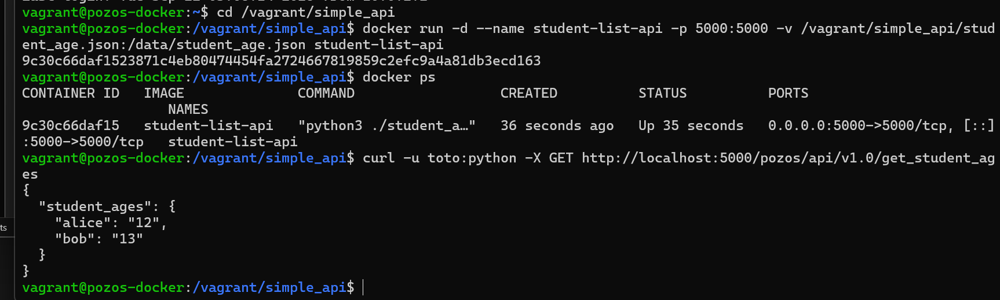
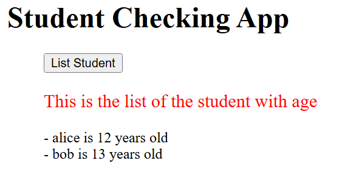
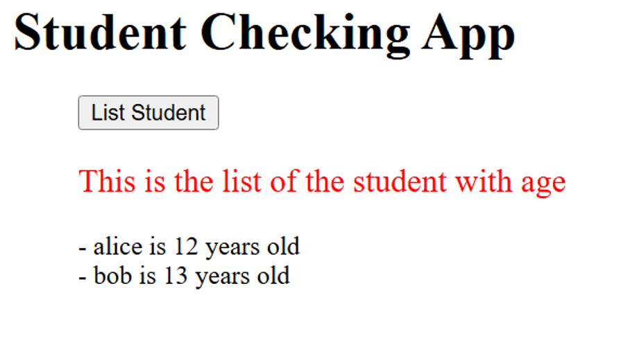
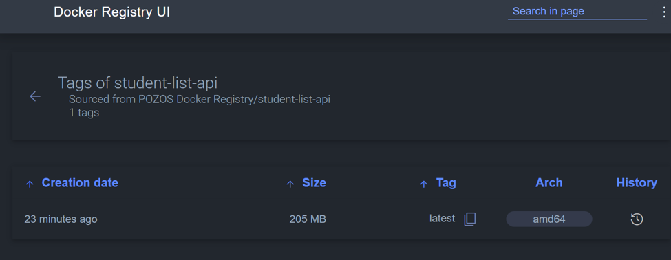

# POZOS — Docker Infrastructure POC

Projet réalisé par **Dakin Blair** dans le cadre d'un examen pratique sur la gestion d'infrastructure Docker.

## Contexte

POZOS est une entreprise fictive qui développe des logiciels pour les lycées. L'objectif de ce POC est de dockeriser une application existante (`student_list`) composée de deux modules :
- Une API REST en Flask (authentification basique, données JSON)
- Une application web en PHP qui consomme cette API

Le tout est orchestré via `docker-compose`, avec un registre Docker privé pour stocker les images.

## Architecture

```
                        Navigateur / Utilisateur
                                  │
                 ┌────────────────┴────────────────┐
                 │ localhost:80                     │ localhost:5000
                 ▼                                   ▼
        ┌─────────────────┐                 ┌─────────────────┐
        │     website      │   http://api:5000  │       api        │
        │   (php:apache)   │ ───────────────▶ │  (Flask/Python)  │
        │   port 80        │                 │   port 5000      │
        └─────────────────┘                 └─────────────────┘
                 │                                   │
                 └───────────────┬───────────────────┘
                                  │
                        réseau Docker : pozos-network


        ┌─────────────────┐                 ┌──────────────────┐
        │  docker-registry │ ◀────────────── │   registry-ui     │
        │   port 5001      │   consulte via   │   port 8081       │
        │  (registry:2)    │   localhost:5001 │ (joxit/registry- │
        └─────────────────┘                 │      ui)          │
                 ▲                           └──────────────────┘
                 │
         docker push / pull
      (student-list-api)
```

## Ma démarche technique et les obstacles rencontrés

### Choix initial : Vagrant + VirtualBox

J'ai d'abord mis en place le projet avec une VM Ubuntu 20.04 provisionnée via Vagrant et VirtualBox, conformément à la recommandation de l'énoncé d'utiliser un environnement Ubuntu dédié.

**Étapes que j'ai réalisées avec succès dans cet environnement :**
- Création d'un `Vagrantfile` avec redirection de ports (5000, 5001, 80/8888)
- Script `provision.sh` installant Docker automatiquement
- Build et test de l'image API réussis dans cette VM

### Obstacles rencontrés avec VirtualBox

J'ai rencontré plusieurs blocages techniques lors du démarrage et de l'exécution de la VM :

1. **Conflit d'hyperviseur (Hyper-V)** : ma machine de développement est un Surface Laptop 5 ("Secured-core PC"), avec Hyper-V activé par défaut. Cela provoquait des plantages du noyau Linux dans la VM (`rcu_sched self-detected stall on CPU`), rendant la VM instable ou totalement inaccessible en SSH.

2. **Memory Integrity (Core Isolation)** : la désactivation d'Hyper-V via `bcdedit` n'a pas suffi — Windows réactivait la virtualisation via cette protection de sécurité, ce qui m'a obligé à la désactiver manuellement dans les paramètres de sécurité Windows.

3. **Virtualization-based Security (VBS) imposée par politique d'entreprise** : malgré toutes mes désactivations manuelles, `msinfo32` continuait d'afficher `Virtualization-based security: Running`. Le SKU de ma machine (`Surface_Laptop_5_for_Business`) et la présence d'`App Control for Business: Enforced` m'ont indiqué que cette machine est administrée par une politique d'entreprise/MDM qui réimpose ces protections à chaque démarrage — je n'ai donc pas pu la désactiver durablement sans droits administrateur du parc informatique.

4. **Guest Additions manquantes** : lors d'un changement de box Vagrant (`bento/ubuntu-20.04` → `ubuntu/focal64`, tenté pour contourner un blocage), le dossier partagé `/vagrant` ne se montait plus. J'ai dû installer manuellement `virtualbox-guest-utils` et `virtualbox-guest-dkms`.

### Solution que j'ai retenue : Docker Desktop + WSL2

Face à ces contraintes de sécurité indépendantes de ma volonté, j'ai basculé sur **Docker Desktop avec WSL2**, déjà installé sur ma machine. Cette approche reste conforme à l'énoncé, qui demande "une seule machine avec Docker installé" — WSL2 remplissant ce rôle sans les conflits de virtualisation que j'ai rencontrés avec VirtualBox, puisqu'il s'appuie sur la même couche de virtualisation Windows (Hyper-V/VBS) au lieu d'entrer en conflit avec elle.

J'ai donc réalisé tous mes tests et déploiements finaux directement depuis Windows via Docker Desktop/WSL2.

## 1. Build and test — Dockerfile de l'API

Dans mon `Dockerfile` (dans `simple_api/`), j'ai :
- Utilisé `python:3.11-slim` comme image de base
- Installé les dépendances système nécessaires à la compilation de `flask_simpleldap` (paquet Python avec extension native en C nécessitant `gcc`, `build-essential`, `libldap2-dev`, `libsasl2-dev`, `libssl-dev`)
- Copié uniquement `student_age.py` et `requirements.txt` (le fichier `student_age.json` est monté en volume plutôt que copié en dur, pour respecter la logique de données persistantes)
- Exposé le port 5000
- Déclaré `/data` comme volume

**Test de fonctionnement de l'API :**



Commande de test :
```bash
curl -u toto:python -X GET http://localhost:5000/pozos/api/v1.0/get_student_ages
```

Réponse obtenue :
```json
{
  "student_ages": {
    "alice": "12",
    "bob": "13"
  }
}
```

## 2. Infrastructure As Code — docker-compose.yml

J'ai orchestré deux services principaux :

- **`api`** : utilise l'image `student-list-api` que j'ai construite précédemment, monte `student_age.json` dans `/data/`, expose le port 5000
- **`website`** : image `php:apache`, variables d'environnement `USERNAME`/`PASSWORD` pour l'authentification vers l'API, monte mon dossier `website/`, démarre après `api` (`depends_on`), expose le port 80

J'ai relié les deux services via un réseau Docker dédié (`pozos-network`), ce qui permet à `index.php` de contacter l'API via son nom de service (`http://api:5000/...`) plutôt que par IP.

**Test du site web complet :**



## 3. Docker Registry

J'ai ajouté un registre Docker privé (`registry:2`) et son interface web (`joxit/docker-registry-ui`) au `docker-compose.yml`.

Point technique particulier : j'ai dû configurer les en-têtes CORS (`REGISTRY_HTTP_HEADERS_Access-Control-Allow-Origin`, etc.) sur le service `registry`, nécessaire pour que l'interface web (exécutée côté navigateur) puisse interroger l'API du registre sans être bloquée par la politique de sécurité du navigateur.

**Push de l'image vers le registre :**

```bash
docker tag student-list-api localhost:5001/student-list-api
docker push localhost:5001/student-list-api
```



**Image visible dans l'interface web :**



## Structure du dépôt

```
pozos/
├── README.md
├── docker-compose.yml
├── simple_api/
│   ├── Dockerfile
│   ├── student_age.py
│   ├── requirements.txt
│   └── student_age.json
├── website/
│   └── index.php
├── Vagrantfile
├── provision.sh
└── images/
```

## Comment lancer le projet

```bash
docker build -t student-list-api ./simple_api
docker compose up -d
```

Accès :
- Site web : http://localhost:80
- API : http://localhost:5000/pozos/api/v1.0/get_student_ages
- Registre : http://localhost:5001/v2/_catalog
- Interface registre : http://localhost:8081
