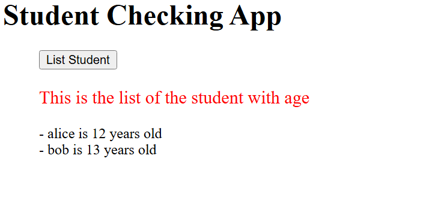

# POZOS — Docker Infrastructure POC

Projet réalisé par **Dakin Blair** dans le cadre d'un examen pratique sur la gestion d'infrastructure Docker.

## Contexte

POZOS est une entreprise fictive qui développe des logiciels pour les lycées. L'objectif était de dockeriser une application existante (student_list) composée d'une API Flask et d'un site PHP, d'orchestrer le tout avec docker-compose, et de déployer un registre Docker privé.

```
Navigateur ──▶ website (php:apache, :80) ──▶ api (Flask, :5000)
                        │                          │
                        └──────── pozos-network ────┘

docker push/pull ──▶ registry (:5001) ◀── registry-ui (:8081)
```

## Ma démarche et les obstacles rencontrés

J'ai d'abord voulu travailler avec une VM Ubuntu provisionnée via **Vagrant et VirtualBox** (Vagrantfile et provision.sh), comme le suggérait l'énoncé. J'ai réussi à créer la VM, installer Docker dedans et builder l'API, mais j'ai rencontré une série de blocages que je n'ai pas pu résoudre moi-même :

- **Conflit avec Hyper-V** : mon Surface Laptop 5 est un "Secured-core PC" avec Hyper-V actif par défaut, ce qui faisait planter le noyau Linux de la VM (erreur rcu_sched self-detected stall on CPU).
- **Memory Integrity (Core Isolation)** : désactiver Hyper-V via bcdedit n'a pas suffi, Windows réactivait la virtualisation via cette protection.
- **VBS imposée par politique d'entreprise** : même après ces désactivations, msinfo32 montrait toujours que la virtualization-based security était active. Ma machine (Surface Laptop 5 for Business, avec App Control for Business imposé) est gérée par une politique MDM qui réimpose ces protections — je n'avais pas les droits pour la désactiver durablement.
- **Guest Additions manquantes** après un changement de box Vagrant, cassant le dossier partagé /vagrant (corrigé en réinstallant les paquets virtualbox-guest-utils et dkms).

Après ces blocages indépendants de ma volonté, j'ai basculé sur **Docker Desktop avec WSL2**, déjà installé sur ma machine. L'énoncé demande une seule machine avec Docker installé, ce que WSL2 remplit sans entrer en conflit avec la virtualisation Windows. J'ai refait tous mes tests et déploiements finaux depuis cet environnement.

## 1. Build and test — API

Dans mon Dockerfile (dossier simple_api), je pars de l'image python:3.11-slim, j'installe les dépendances système nécessaires à la compilation de flask_simpleldap (gcc, build-essential, libldap2-dev, libsasl2-dev, libssl-dev), et je monte student_age.json en volume plutôt que de le copier dans l'image.


Commande de test :

```bash
curl -u toto:python -X GET http://localhost:5000/pozos/api/v1.0/get_student_ages
```

## 2. Infrastructure as Code — docker-compose

Mon docker-compose.yml orchestre les services api et website sur un réseau dédié (pozos-network), ce qui permet au site d'joindre l'API via son nom de service plutôt que par IP.


## 3. Docker Registry

J'ai ajouté un registre privé (image registry:2) et son interface web (joxit/docker-registry-ui). J'ai dû configurer des en-têtes CORS sur le service registry pour que l'interface, exécutée dans le navigateur, puisse interroger le registre sans être bloquée.

```bash
docker tag student-list-api localhost:5001/student-list-api
docker push localhost:5001/student-list-api
```


## Pour aller plus loin

L'énoncé proposait plusieurs pistes pour renchérir le projet. J'en ai implémenté quatre :

**Build multistage** — Mon Dockerfile de l'API utilise maintenant deux stages : un premier stage (builder) installe gcc, build-essential et les paquets -dev nécessaires à la compilation de flask_simpleldap, un second stage ne garde que les paquets Python déjà compilés. L'image finale est plus légère (51.3 Mo de contenu propre, contre environ 205 Mo avant).

**Healthcheck** — J'ai ajouté une instruction HEALTHCHECK dans le Dockerfile de l'API, qui vérifie toutes les 30 secondes que l'API répond correctement via une requête curl interne. Docker Desktop affiche alors le statut (healthy) du container.

**Docker Swarm** — J'ai initialisé Swarm sur ma machine et créé un fichier docker-stack.yml séparé du docker-compose.yml, pour déployer les 4 services (api, website, registry, registry-ui) via docker stack deploy plutôt que docker compose.

**Secrets Docker (mots de passe chiffrés)** — Plutôt que de mettre USERNAME et PASSWORD en clair dans la configuration, je les stocke comme des secrets Docker (docker secret create), qui ne nécessitent le mode Swarm. Pour ne pas modifier le code de l'application (index.php), j'utilise un entrypoint personnalisé dans docker-stack.yml qui lit les fichiers de secrets montés dans le container (/run/secrets/...) et les exporte en variables d'environnement avant de démarrer Apache.

J'ai rencontré un bug intéressant en mettant ça en place : j'avais créé mes secrets avec `echo "toto" | docker secret create student_username -` depuis PowerShell, ce qui ajoute un retour à la ligne Windows (\r\n) à la fin de la valeur. La substitution de commande dans mon entrypoint supprimait bien le \n final, mais pas le \r, ce qui donnait un nom d'utilisateur `toto\r` au lieu de `toto` — l'API rejetait donc l'authentification (401 Unauthorized) même si les identifiants semblaient corrects. J'ai corrigé ça en recréant les secrets avec Set-Content -NoNewline, qui n'ajoute aucun caractère de fin de ligne.



**Registre privé sur un environnement distant** — Je n'ai pas implémenté ce point : il demande une vraie deuxième machine accessible sur le réseau (un VPS, un autre serveur), que je n'ai pas. En théorie, la démarche serait de déployer uniquement le service registry sur cette machine distante, d'exposer son port, puis de pousser/tirer les images depuis ma machine locale avec docker tag et docker push en ciblant l'adresse de cette machine plutôt que localhost.

## Structure du dépôt

```
pozos/
├── README.md
├── docker-compose.yml
├── docker-stack.yml
├── simple_api/
│   ├── Dockerfile
│   ├── student_age.py
│   ├── requirements.txt
│   └── student_age.json
├── website/
│   └── index.php
├── Vagrantfile
├── provision.sh
└── images/
```

## Lancer le projet

```bash
docker build -t student-list-api ./simple_api
docker compose up -d
```

- Site web : http://localhost:80
- API : http://localhost:5000/pozos/api/v1.0/get_student_ages
- Registre : http://localhost:5001/v2/_catalog
- Interface registre : http://localhost:8081
